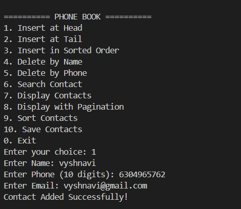
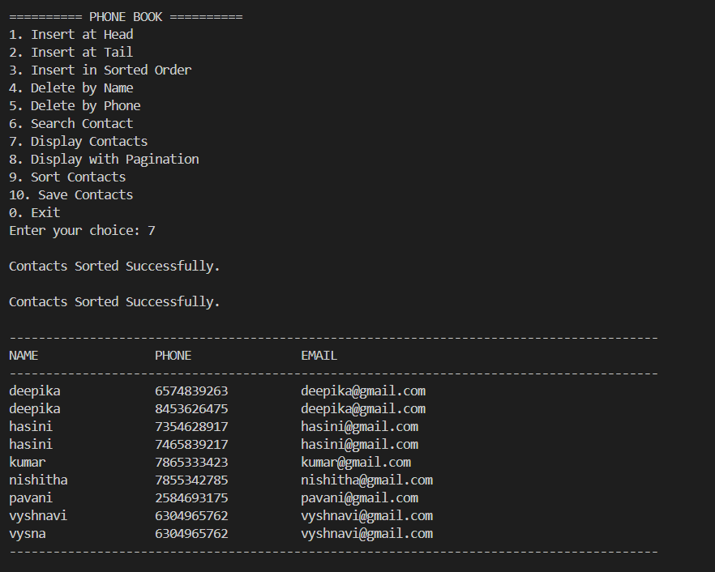
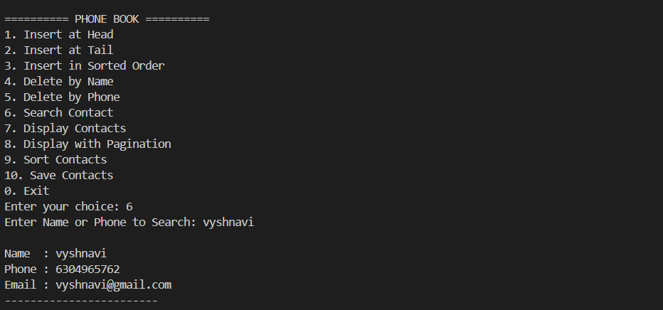

# 📞 Phone Book Management System

A console-based **Phone Book Management System** developed in **C++** using a **Singly Linked List** data structure. This project demonstrates efficient contact management with file handling, searching, sorting, duplicate detection, and pagination.

---

## 📌 Features

- ➕ Add New Contact
- 📋 Display All Contacts
- 🔍 Search Contact
- ✏️ Update Contact Details
- ❌ Delete Contact
- 📂 File Handling (Save & Load Contacts)
- 🔄 Sort Contacts Alphabetically
- 🚫 Duplicate Contact Detection
- 📖 Pagination for Easy Navigation
- 💻 User-Friendly Menu Interface

---

## 🛠️ Technologies Used

- **Language:** C++
- **Data Structure:** Singly Linked List
- **Concepts:**
  - Object-Oriented Programming
  - File Handling
  - Dynamic Memory Allocation
  - Searching
  - Sorting

---

## 📁 Project Structure

```
phoneBook-Management-System/
│
├── phonebook.cpp
├── README.md
├── add_contact.png
├── display_contact.png
├── search_contact.png
└── main_menu.png
```

---

## 🚀 How to Run

1. Clone the repository.
2. Open the project in any C++ IDE (VS Code, CodeBlocks, Dev-C++, etc.).
3. Compile the `phonebook.cpp` file.
4. Run the executable.
5. Use the menu to manage contacts.

---

## 📷 Project Screenshots

### 🏠 Main Menu


### ➕ Add Contact



### 📋 Display Contacts



### 🔍 Search Contact



---

## 🎯 Learning Outcomes

This project helped us understand:

- Linked List implementation
- File handling in C++
- Dynamic memory management
- Searching and sorting algorithms
- Menu-driven application development
- Real-world data structure applications

---

## 👥 Team Members

| Role | Name |
|------|------|
| Mentor | M. Suhas |
| Team Leader | A. Vyshnavi |
| Member | N. Rohit Krishna |
| Member | K. Jayasree |
| Member | **Pranay Yadav** |

---

## 🌟 Future Enhancements

- GUI Application
- Password Protection
- Export Contacts to CSV
- Contact Groups
- Favorites List
- Backup & Restore
- Cloud Synchronization

---

## 📜 License

This project is developed for educational purposes as part of an academic project.

---

## ⭐ Support

If you found this project helpful, don't forget to **Star ⭐ the repository**.
