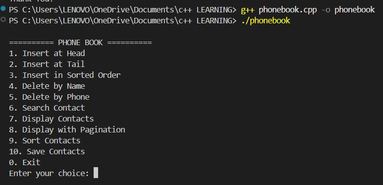

# 📱 Phone Book Management System

A C++ Phone Book Management System using **Singly Linked List** with file handling, searching, sorting, duplicate detection, and pagination.

---

# 👥 Team

| Role | Name |
|------|-------|
| Mentor | M.Suhas |
| Team Leader | A.Vyshnavi |
| Member | N. Rohit Krishna|
| Member | K. Jayasree  |
| Member | D. Pranay |

---


##  Overview

The Phone Book Management System is a simple console-based application developed in C++. It uses a Singly Linked List to store and manage contact information. Users can add, search, update, delete, and display contacts easily. The project also supports alphabetical sorting using the Merge Sort algorithm. File handling is used to save and load contacts permanently. Duplicate contact detection helps avoid repeated entries. Pagination is included to display contacts in an organized way. The project demonstrates the use of data structures, file handling, and object-oriented programming concepts. It is easy to use through a menu-driven interface. This project is suitable for learning C++ programming and linked list implementation.

# ✨ Features

| No | Feature | Description |
|----|---------|-------------|
| 1 | Add Contact | Add a new contact |
| 2 | Search Contact | Search by name |
| 3 | Delete Contact | Delete by name or phone number |
| 4 | Display Contacts | View all contacts |
| 5 | Sort Contacts | Alphabetical order using Merge Sort |
| 6 | File Handling | Save and load contacts |
| 7 | Pagination | Display contacts page by page |

---

# 🛠️ Technologies Used

- C++
- Singly Linked List
- File Handling
- Object-Oriented Programming
- Visual Studio Code

---

# 📂 Project Structure

```text
phoneBook-Management-System/
│
├── README.md
├── main.cpp
├── contacts.txt
│
├── screenshots/
│   ├── menu.png
│   ├── add.png
│   ├── display.png
│   ├── search.png
│   └── delete.png
│
└── docs/
    └── Project_Report.pdf
```

---

# ⚙️ Requirements

- C++17
- g++
- Visual Studio Code

---

# ▶️ Compile & Run

```bash
g++ main.cpp -o phonebook
```

Run:

```bash
./phonebook
```

Windows:

```bash
phonebook.exe
```

---


## 📸 Screenshots

### Main Menu


### Add Contact


### Display Contacts


### Search Contact


### Delete Contact

---

# 🖥️ Sample Output

```text
==================== PHONE BOOK MANAGEMENT SYSTEM ====================

1. Insert at Head
2. Insert at Tail
3. Insert in Sorted Order
4. Delete by Name
5. Delete by Phone Number
6. Search by Partial Name
7. Display Contacts
8. Display with Pagination
9. Sort Contacts
0. Exit

Enter your choice: 3

Enter Name  : Vyshnavi
Enter Phone : 9876543210
Enter Email : vyshnavi@gmail.com

Contact Added Successfully!

---------------------------------------------------------------------

Enter your choice: 3

Enter Name  : Hasini
Enter Phone : 9123456789
Enter Email : hasini@gmail.com

Contact Added Successfully!

---------------------------------------------------------------------

Enter your choice: 3

Enter Name  : Pavani
Enter Phone : 9988776655
Enter Email : pavani@gmail.com

Contact Added Successfully!

---------------------------------------------------------------------

Enter your choice: 7

==================== CONTACT LIST ====================

---------------------------------------------------------------
NAME                 PHONE               EMAIL
---------------------------------------------------------------
Hasini               9123456789          hasini@gmail.com
Pavani               9988776655          pavani@gmail.com
Vyshnavi             9876543210          vyshnavi@gmail.com
---------------------------------------------------------------

Enter your choice: 6

Enter Partial Name: pav

Contact Found!

Name  : Pavani
Phone : 9988776655
Email : pavani@gmail.com

---------------------------------------------------------------------

Enter your choice: 4

Enter Name: Hasini

Contact Deleted Successfully!

---------------------------------------------------------------------

Enter your choice: 7

==================== CONTACT LIST ====================

---------------------------------------------------------------
NAME                 PHONE               EMAIL
---------------------------------------------------------------
Pavani               9988776655          pavani@gmail.com
Vyshnavi             9876543210          vyshnavi@gmail.com
---------------------------------------------------------------

Enter your choice: 8

==================== PAGE 1 ====================

---------------------------------------------------------------
NAME                 PHONE               EMAIL
---------------------------------------------------------------
Pavani               9988776655          pavani@gmail.com
Vyshnavi             9876543210          vyshnavi@gmail.com
---------------------------------------------------------------

End of Contacts.

---------------------------------------------------------------------

Enter your choice: 0

Saving contacts to contacts.txt...

Thank You for Using Phone Book Management System!
Program Exited Successfully.
========== PHONE BOOK MANAGEMENT SYSTEM ==========

1. Add Contact
2. Search Contact
3. Update Contact
4. Delete Contact
5. Display Contacts
6. Exit

Enter your choice:
```

---

# 📚 Data Structures Used

- Singly Linked List
- Dynamic Memory Allocation
- Merge Sort

---

# ⏱️ Time Complexity

| Operation | Complexity |
|-----------|------------|
| Insert | O(1) |
| Search | O(n) |
| Delete | O(n) |
| Display | O(n) |
| Merge Sort | O(n log n) |

---

# 🎯 Learning Outcomes

- Linked List Implementation
- File Handling
- Merge Sort
- Searching Algorithms
- Dynamic Memory Allocation
- Object-Oriented Programming

---

# 🚀 Future Enhancements

- GUI Version
- Database Integration
- Login Authentication
- Cloud Storage
- Mobile App Support

---

# 📜 License

This project is developed for educational purposes.
